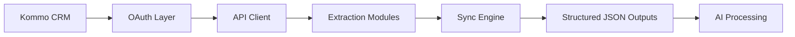

# Kommo CRM Automation System — Milestone 1 Delivery

## 1. Project Overview

This integration provides a fully automated, production-ready data pipeline between your Kommo CRM and your downstream data infrastructure. 

The primary objective of this system is to securely extract, structure, and organize your CRM data—with a specific focus on sales conversations—to enable advanced AI analysis using Claude. By automatically pulling the latest leads, contacts, and daily chat messages into an AI-ready format, this system empowers you to generate deep insights into sales performance, customer sentiment, objection handling, and buying signals without manual data wrangling.

## 2. What Has Been Delivered (Milestone 1)

The technical foundation and core extraction pipelines are fully complete and production-ready. The following components have been successfully delivered:

- **Authentication & Core Infrastructure**
  - Secure OAuth 2.0 authentication system with automatic, hands-free token refresh.
  - Robust API client featuring intelligent retry logic, pagination handling, and rate limiting compliance.
- **Data Extraction Modules**
  - **Leads:** Complete extraction with pipeline and stage tracking.
  - **Pipelines:** Full pipeline architectures and status structures.
  - **Tasks:** Task extraction including completion status and ownership (supports both full and slim formats).
  - **Contacts:** Contact information extraction, securely linked to corresponding leads.
  - **Chats & Messages:** Deep extraction of conversation threads across all connected channels (WhatsApp, Email, SMS, Telegram, etc.).
- **Data Intelligence & Processing**
  - **AI-Ready Message Dataset:** Delivery of `messages_flat.json`, a highly specialized, flattened dataset designed specifically for seamless consumption by Claude AI.
  - **Incremental Sync System:** Intelligent state tracking ensures only new or updated data is fetched in subsequent runs, maximizing speed and efficiency.
- **Reliability & Automation**
  - **GitHub Actions Pipeline:** Fully configured daily automation for zero-touch execution.
  - **Production Safeguards:** Dead-letter error handling, atomic file writes (to prevent data corruption), and structured logging.

## 3. System Architecture

The pipeline follows a clean, modular data flow designed for maximum reliability:

## 4. Output Data Structure

The system produces clean, validated JSON datasets, stored securely and ready for downstream use:

- `leads.json`: Contains full lead profiles, ownership details, and current pipeline stages.
- `pipelines.json`: Maps the structure of your sales pipelines and status codes.
- `tasks.json`: Records all activities, to-dos, and their completion states.
- `contacts.json`: Houses contact details (names, phone numbers, emails) linked to leads.
- `chats.json`: Thread-level conversation metadata.
- `messages_flat.json`: **The primary AI deliverable.** This file combines leads, contacts, and chat messages into a single, chronological, flattened schema. It includes the channel, direction (inbound/outbound), author, and text content, making it instantly ready for Claude to analyze without further data joining.

## 5. Key Features

- **Fully Automated Daily Execution:** Runs seamlessly in the background via GitHub Actions.
- **Incremental Sync:** Remembers where it left off. After the initial sync, it only downloads new messages and updated leads, ensuring rapid daily updates and zero data duplication.
- **Secure Authentication:** Credentials are encrypted and handled autonomously. The system refreshes its own access daily.
- **Production-Grade Reliability:** Built-in safeguards mean network blips or Kommo API timeouts are automatically retried. Validation errors are neatly set aside (dead-lettered) rather than crashing the system.
- **Scalable Architecture:** Designed to handle thousands of daily messages with a minimal memory footprint.

## 6. How It Runs

The system requires absolutely no manual intervention. 

It is deployed via **GitHub Actions** and scheduled to run automatically every day. During each run, it securely authenticates, checks for any new conversations or updated records since the last run, extracts the new data, updates its internal cursor, and securely outputs the finalized AI-ready datasets. 

## 7. Next Phase Enhancements

With the data foundation successfully delivered, the system is primed for the next phase of integrations:

- **Google Sheets Integration:** Automatically pushing the flattened message data and AI insights into a live, collaborative Google Sheet.
- **Advanced AI Analysis Layer:** Wiring the `messages_flat.json` output directly into Claude for automated sentiment scoring and objection analysis.
- **Dashboarding & Reporting:** Building visual operational dashboards on top of the extracted datasets.
- **Performance Optimizations:** Implementing parallel processing for massive-scale enterprise accounts.

## 8. Final Statement

The Kommo CRM Automation System is **production-ready**. Milestone 1 has been successfully delivered, providing a resilient, secure, and automated data pipeline. The infrastructure is robust, the data is clean, and the system is fully prepared for the next phase of advanced AI integration.
